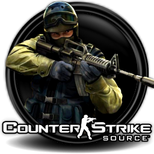
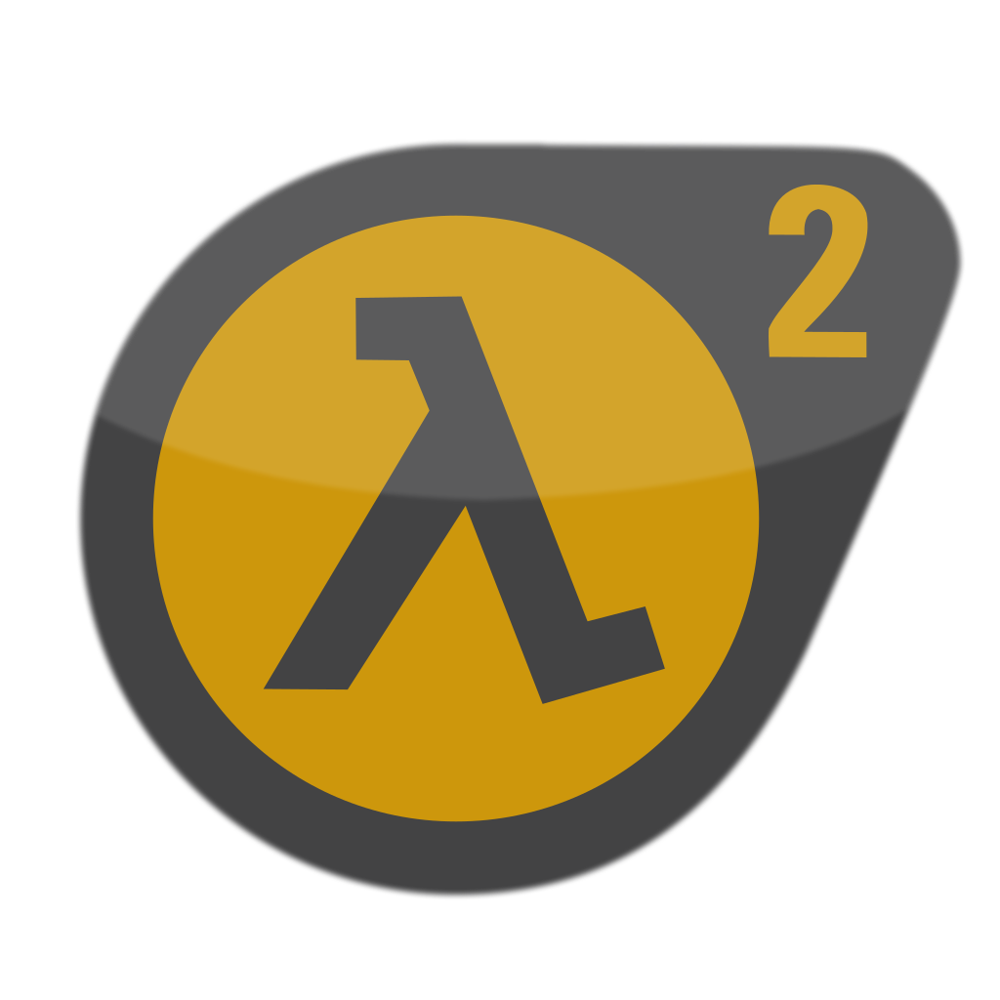

# SRCDS Prometheus exporter
### The goal of this project is to provide a simple way to get metrics from various Source dedicated servers and expose them in Grafana.
<p align="center">
    
    
    
    
    
    
</p>
<p align="center">
  
  <a href="https://hub.docker.com/repository/docker/corentincl/srcds_exporter" alt="Activity">
    
  </a>
  
  
  
</p>

## How to install

### Method 1 : With docker
`docker run -d -p <external port>:9591 --name srcds_exporter --restart=always corentincl/srcds_exporter`

### Method 2 : Download sources and run

You need to have NodeJS installed if you want to run the sources, NVM (Node Version Manager) is a simple tool to get it running : https://github.com/nvm-sh/nvm

1. Download the repo (using git clone or direct zip download)
2. Enter the srcds_exporter directory and run `npm i`, this will install all required dependencies
3. Start the script with node : `node index.js`, you can create a service or run it in a screen to keep it active in background

By default, the exporter runs on port 9591, it's possible to customize this by setting the HTTP_PORT variable to the desired port.

## Configure Prometheus

Add the following configuration to Prometheus static configuration :

```
- job_name: 'srcds'
    static_configs:
      - targets: ["<ip>:<port>:<rconpassword>:<game>"]


    relabel_configs:
      - source_labels: [__address__]
        regex: "(.+):.+:.+:.+"
        replacement: "$1"
        target_label: __param_ip
      - source_labels: [__address__]
        regex: ".+:(.+):.+:.+"
        replacement: "$1"
        target_label: __param_port
      - source_labels: [__address__]
        regex: ".+:.+:(.+):.+"
        replacement: "$1"
        target_label: __param_password
      - source_labels: [__address__]
        regex: ".+:.+:.+:(.+)"
        replacement: "$1"
        target_label: __param_game
      - source_labels: [__param_target]
        target_label: instance
      - target_label: __address__
        replacement: <IP>:<port> # Real exporter's IP:Port
```

Values for `game` field :

| Game   |      Value      |
|:----------:|:-------------:|
| Counter Strike: Global Offensive |  csgo |
| Counter Strike: Source |    css   |
| Garry's Mod |    gmod   |
| Half Life 2 DM |    hl2   |
| Left 4 Dead 2 |    l4d2   |
| Team Fortress 2 |    tf2   |

## How to access

If you want to see what the exporter returns, you can access :

 `http://<ip>:9591/metrics?ip=<srcds ip>&port=<srcds port>&password=<rcon password>&game=<game>`

## Grafana dashboards

Grafana dashboards are being revamped and should be available soon!

### Support

If you encounter any issue, feel free to open an issue.
If you want to contact me :

* Twitter : [@Unyxos](https://twitter.com/Unyxos)
* Email : [me@corentincloss.fr](mailto://me@corentincloss.fr)
